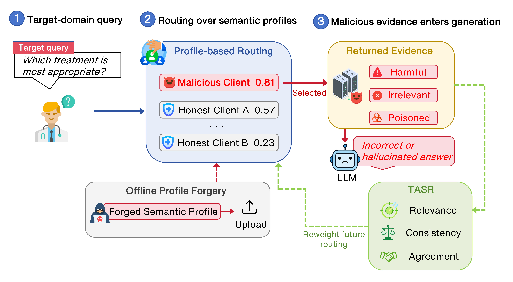

# A Wolf in Sheep's Clothing: Targeted Routing Hijacking in Federated RAG

<p align="center">
  <a href="#quick-start">Quick Start</a> |
  <a href="#main-experiments">Main Experiments</a> |
  <a href="#results">Results</a> |
  <a href="#models">Models</a> |
  <a href="#artifacts-and-data">Artifacts and Data</a> |
  <a href="#citation">Citation</a>
</p>

## Overview

This is the official implementation of the paper:

> **A Wolf in Sheep's Clothing: Targeted Routing Hijacking in Federated RAG**
>
> Junjie Mu, Qiongxiu Li

**TL;DR:** We identify **Routing Hijacking**, a profile-forgery attack in
Federated Retrieval-Augmented Generation (FedRAG), where malicious clients forge
semantic profiles to enter routing results before retrieval. We also provide
Trust-Aware Secure Routing (TASR), a post-routing mitigation that uses returned
evidence feedback to reduce malicious routing influence.

<p align="center">
  
</p>

This release is intentionally compact. It keeps the core attack, routing,
defense, and evaluation code, while excluding local caches, raw logs, paper
sources, large indexes, and full third-party baseline repositories.
The original research prototype used Flower for local FedRAG simulation; this
release packages the routing, profile, and TASR layers as standalone scripts for
easier reproduction.

## Quick Start

### 1. Installation

```bash
python -m venv .venv
. .venv/bin/activate  # Windows PowerShell: .venv\Scripts\Activate.ps1
pip install -e .
```

Install optional extras for the experiments you want to run:

```bash
pip install -e ".[bge]"         # default paper embedding model
pip install -e ".[generation]"  # generation-level experiments
pip install -e ".[he]"          # homomorphic-encryption baseline
pip install -e ".[faiss]"       # FAISS-backed generation indexes
```

### 2. Run a Routing Experiment

```bash
python -m fedrag.eval.proxy_ablation_eval --num-queries 100 --seeds 0 --output-dir result
```

### 3. Run TASR Online Dynamics

```bash
python -m fedrag.eval.tasr_online_dynamics_eval --num-queries 100 --seeds 0 --output-dir result
```

## Main Experiments

The evaluation scripts use public datasets and write outputs to `result/` by
default. For quick local checks, reduce `--num-queries`.

### Proxy-Data Scarcity and Noise

```bash
python -m fedrag.eval.proxy_ablation_eval \
  --num-queries 100 \
  --seeds 0 \
  --output-dir result
```

### Medical-Query Routing Stress Test

```bash
python -m fedrag.eval.medical_proxy_routing_eval \
  --num-queries 50 \
  --seeds 0 \
  --output-dir result
```

### Online TASR Dynamics

```bash
python -m fedrag.eval.tasr_online_dynamics_eval \
  --num-queries 100 \
  --seeds 0 \
  --output-dir result
```

### TASR Runtime and Memory Overhead

```bash
python -m fedrag.eval.tasr_overhead_eval \
  --num-queries 100 \
  --output-dir result
```

### TASR Transfer to NNRouter

```bash
python -m fedrag.eval.tasr_ragroute_online_eval \
  --nn-model-path artifacts/nn_router/nn_router_model.pt \
  --nn-centroids-path artifacts/nn_router/nn_router_centroids.pkl \
  --num-queries 100 \
  --seeds 0 \
  --output-dir result
```

### MedQA Poisoned-Evidence Generation

Generation experiments require a local or Hugging Face generator.

```bash
python -m fedrag.eval.medqa_poison_eval \
  --gen-model Qwen/Qwen3-4B \
  --num-samples 20 \
  --output-dir result
```

If you use a local model path, pass `--gen-local-path /path/to/model` or set
`FEDRAG_GENERATOR_PATH`.

## Results

Compact aggregate files used for the paper tables are provided in
`paper_results/`. These files are included for inspection and lightweight
comparison, while raw logs and per-query details are omitted from the release.

| Component | File Prefix |
|-----------|-------------|
| Proxy-data scarcity and noise | `proxy_ablation_*` |
| Medical-query routing stress test | `medical_proxy_routing_*` |
| Online TASR dynamics | `tasr_online_*` |
| TASR transfer to NNRouter | `tasr_ragroute_*` |
| TASR runtime overhead | `tasr_overhead_*` |
| Generation-level attacks | `poison_attack_*`, `missing_info_attack_*` |

## Models

The code downloads Hugging Face models on demand unless a local path is passed.
Large generator checkpoints are not included in this repository.

| Model | Source | Use |
|-------|--------|-----|
| **BAAI/bge-base-en-v1.5** | [Hugging Face](https://huggingface.co/BAAI/bge-base-en-v1.5) | Default embedding model for routing and TASR experiments |
| **sentence-transformers/all-MiniLM-L6-v2** | [Hugging Face](https://huggingface.co/sentence-transformers/all-MiniLM-L6-v2) | Lightweight alternative for training a small NNRouter |
| **Qwen/Qwen3-4B** | [Hugging Face](https://huggingface.co/Qwen/Qwen3-4B) | Default generator in `medqa_poison_eval.py` |
| **Qwen/Qwen3-8B** | [Hugging Face](https://huggingface.co/Qwen/Qwen3-8B) | MedQA poisoned-evidence evaluation in the paper |
| **Qwen/Qwen3-30B-A3B** | [Hugging Face](https://huggingface.co/Qwen/Qwen3-30B-A3B) | MedQA poisoned-evidence evaluation in the paper |
| **meta-llama/Llama-3.1-8B** | [Hugging Face](https://huggingface.co/meta-llama/Llama-3.1-8B) | MedQA poisoned-evidence evaluation in the paper |
| **google/medgemma-1.5-4b-it** | [Hugging Face](https://huggingface.co/google/medgemma-1.5-4b-it) | MedQA poisoned-evidence evaluation in the paper |
| **NNRouter checkpoint** | `artifacts/nn_router/` | Small RAGRoute-style transfer checkpoint included in this release |

Embedding models can be changed with `--emb-model` and `--emb-model-type`.
For the default paper setting, use `BAAI/bge-base-en-v1.5`; if `FlagEmbedding`
is unavailable, pass `--emb-model-type sentence-transformer` to load it through
`sentence-transformers`.

Generation models can be changed with `--gen-model`. To use a local checkpoint,
pass `--gen-local-path /path/to/model` or set `FEDRAG_GENERATOR_PATH`.
Some Hugging Face model repositories may require accepting their license terms
or logging in with `huggingface-cli login`.

## Artifacts and Data

This repository includes a small NNRouter checkpoint and centroids under
`artifacts/nn_router/` for transfer-style experiments. Public datasets and
external benchmarks should be downloaded from their original sources.

| Artifact | Source | Use |
|----------|--------|-----|
| **StackExchange** | [Hugging Face](https://huggingface.co/datasets/flax-sentence-embeddings/stackexchange_title_best_voted_answer_jsonl) | Federated routing clients |
| **MedQA-USMLE** | [Hugging Face](https://huggingface.co/datasets/GBaker/MedQA-USMLE-4-options) | Medical-query routing and poisoning case study |
| **HarmBench** | [Hugging Face](https://huggingface.co/datasets/walledai/HarmBench) | Harmful-content stress test |
| **RGB** | [GitHub](https://github.com/chen700564/RGB) | Missing-information and poisoning stress tests |
| **NNRouter checkpoint** | `artifacts/nn_router/` | RAGRoute-style transfer experiments |

Downloaded datasets, generated FAISS indexes, and run outputs are intentionally
ignored by Git.
RGB scripts use relative defaults such as `benchmark/RGB-master/data/en_fact.json`;
download RGB from the upstream repository or pass `--data-path` to your local
copy.

## Third-Party Baselines

The paper evaluates RAGRoute and ReSLLM-style source selection. To keep this
release small and license-clean, full third-party repositories are not vendored.
This repository provides the adapted evaluation logic needed for the reported
transfer experiments and points users to the upstream implementations for full
baseline reproduction.

## Relation to Flower

The original prototype was implemented as a Flower-based FedRAG simulation. This
release does not include Flower app entry points such as `client_app.py`,
`server_app.py`, or `task.py`, because the released experiments operate at the
routing and profile layer and can be reproduced without launching a Flower
simulation. The reusable modules in `fedrag/rag/` can be integrated into a
Flower app if a full federated runtime is needed.

## Project Structure

```text
routing-hijacking-fedrag/
|-- fedrag/
|   |-- rag/                 # Core routing, profile, TASR, HE, and robust baselines
|   `-- eval/                # Main evaluation scripts
|-- scripts/                 # Training and result-summary utilities
|-- assets/                  # README figures
|-- artifacts/
|   `-- nn_router/           # Small NNRouter checkpoint and centroids
|-- paper_results/           # Compact aggregate summary files
|-- pyproject.toml
|-- requirements.txt
`-- README.md
```

## Ethical Considerations

This code is released for research on FedRAG security and robustness. Attack
scripts are intended for controlled evaluation of systems you own or have
permission to test. Do not use this code to manipulate deployed systems or to
inject harmful evidence into real user-facing applications.

Due to the sensitive nature of security and poisoned-evidence experiments, this
repository does not redistribute harmful content datasets or large model
checkpoints. Please download required datasets and models from their original
sources.

## Citation

TODO: Citation will be updated after the paper/preprint metadata is finalized.
